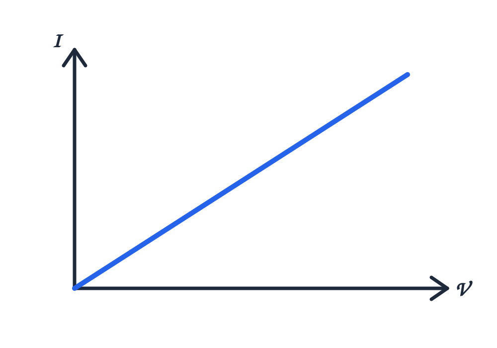
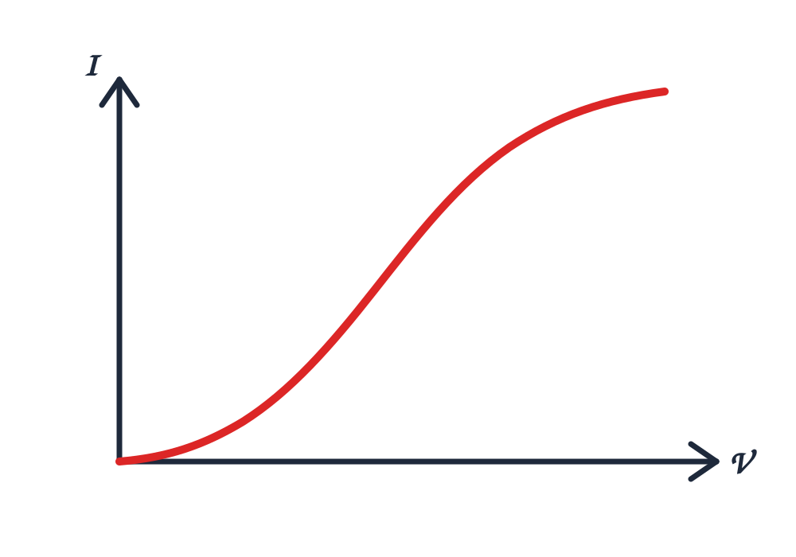

# Linear and Non-Linear Components

## 1. Linear Component

A **linear component** is an electrical component in which the relationship between voltage and current is linear.

For a constant resistance, Ohm's Law is:

$V = IR$

Where:

- $V$ = Voltage
- $I$ = Current
- $R$ = Resistance

### V-I Characteristic

The V-I characteristic of a linear component is a **straight line**.

For a constant resistor, if the voltage increases proportionally, the current also increases proportionally.

### Example

A **resistor with constant resistance** is a common example of a linear component.

---

## 2. Non-Linear Component

A **non-linear component** is an electrical component in which the relationship between voltage and current is not linear.

The voltage and current do not maintain a constant proportional relationship.

### V-I Characteristic

The V-I characteristic of a non-linear component is generally a **curved line** rather than a straight line.

### Examples

- Diode
- Transistor
- Filament Lamp

---

## Difference Between Linear and Non-Linear Components

| Linear Component | Non-Linear Component |
|---|---|
| Voltage-current relationship is linear. | Voltage-current relationship is non-linear. |
| V-I characteristic is a straight line. | V-I characteristic is generally a curved line. |
| Resistance remains constant under the specified operating conditions. | Resistance changes with the operating point. |
| Example: Constant resistor | Examples: Diode, transistor, filament lamp |

## Key Point

**Linear → Straight-line V-I relationship**

**Non-Linear → Curved V-I relationship**
